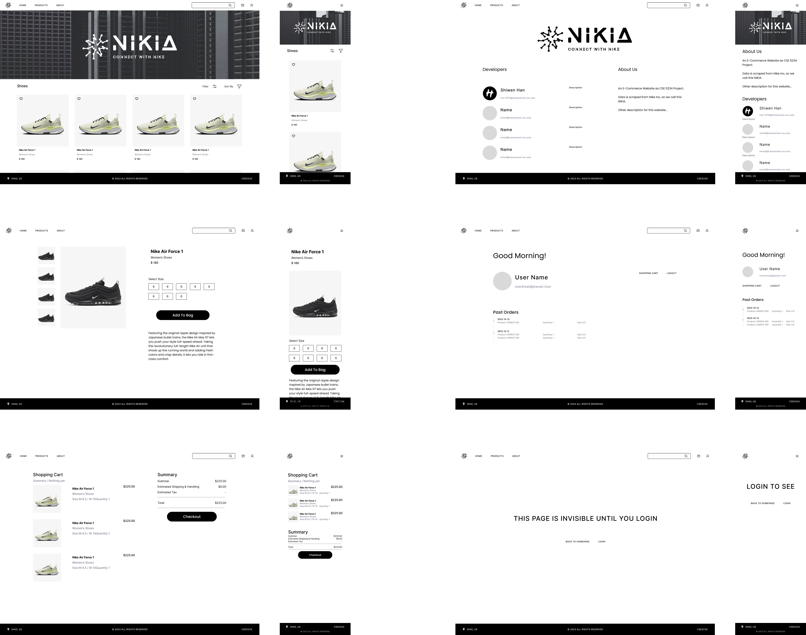

# NIKIA

An e-commerce web application. Data used for the project is [scraped](https://github.com/TSHOGX/scrape-nike-lambda-dynamodb) from Nike Inc, so our website name is NIKIA.

Tech Stack: Next.js, Tailwind, TypeScript, Prisma, CockroachDB, AWS (Lambda, DynamoDB, API Gateway, IAM, CloudWatch)

## Features

- **Serverless microservices** like CRUD and RESTful API runing on AWS Lambda and API gateway enabling filtering, searching and sorting.
- User authentication with [NextAuth.js](https://next-auth.js.org/).
- **Hybrid data model** with NoSQL for products and transactions to enable flexible data analysis, horizontally scalable requests and CPU, I/O optimize; SQL for user accounts and carts to support complicated patterns required by an ecommerce website. 

---



## Development

First, run the development server:

```bash
npm i
npm run dev
```

Open [http://localhost:3000](http://localhost:3000) with your browser to see the result.
